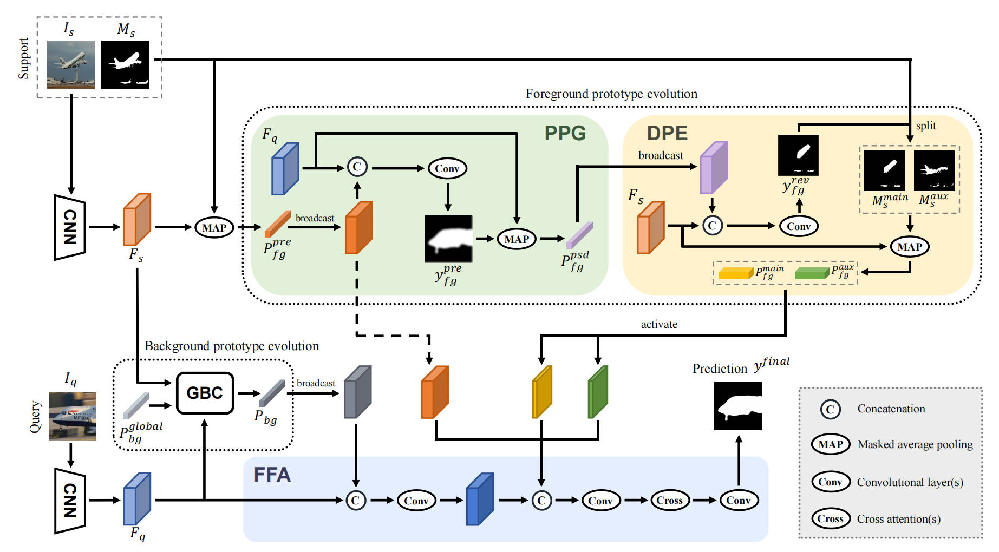
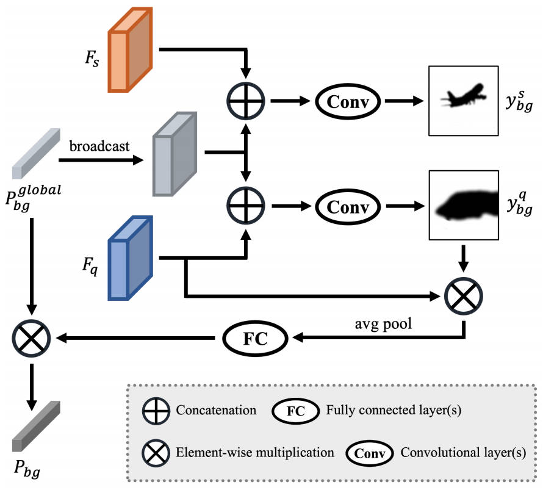
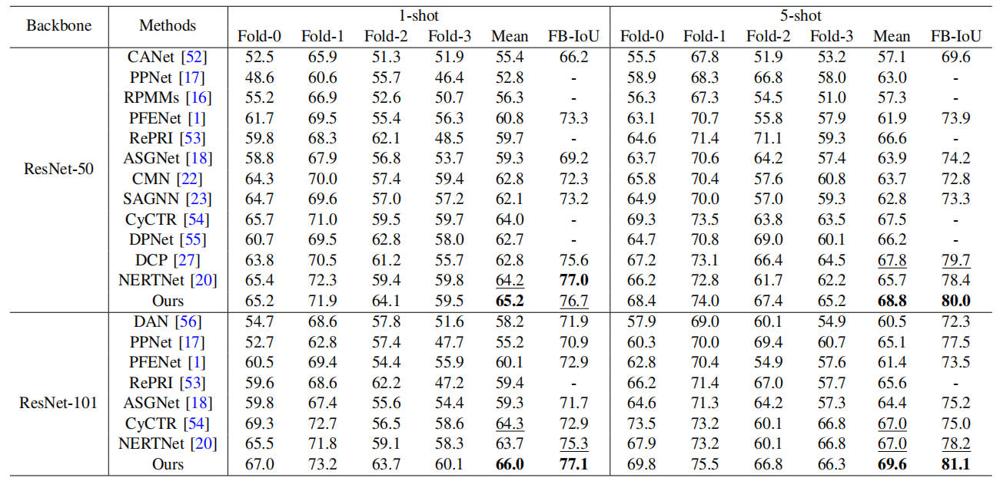

# QPENet_TMM2024

Runmin Cong, Hang Xiong, Jinpeng Chen, Wei Zhang, Qingming Huang, and Yao Zhao, Query-guided Prototype Evolution Network for Few-Shot Segmentation, IEEE Transactions on Multimedia. In Press.

## Network

#### Our overall framework:



#### GBC Module



#### Requirement:

Pleasure configure the environment according to the given version:

- python 3.6.13
- pytorch 1.8.2+cu111
- torchvision 0.9.2
- numpy 1.19.5
- opencv-python 4.6.0.66
- pycocotools 2.0.6

## Data Preparation

 Please follow the tips to download the processed datasets:

1. PASCAL-5i: Please refer to [PFENet](https://github.com/dvlab-research/PFENet) to prepare the PASCAL dataset for few-shot segmentation.
2. COCO-20i: Please download [COCO2017](https://cocodataset.org/#download) dataset from here. Put or link the dataset to YOUR_PROJ_PATH/data/coco.

## Training and Testing

**Training command** :
Download the ImageNet [pretrained](https://mycuhk-my.sharepoint.com/personal/1155122171_link_cuhk_edu_hk/_layouts/15/onedrive.aspx?id=%2Fpersonal%2F1155122171%5Flink%5Fcuhk%5Fedu%5Fhk%2FDocuments%2FPFENet%20TPAMI%20Submission%2FPFENet%5Fcheckpoints%2Fbackbone%2Ezip&parent=%2Fpersonal%2F1155122171%5Flink%5Fcuhk%5Fedu%5Fhk%2FDocuments%2FPFENet%20TPAMI%20Submission%2FPFENet%5Fcheckpoints&ga=1) backbones and put them into the `initmodel` directory.

Then, run this command:

```
sh train.sh
```

**Testing command** :

* Change configuration via the `.yaml` files in `config` (specify checkpoint path)
* Run the following command:

```
sh test.sh
```

We provide 16 [pre-trained](https://pan.baidu.com/s/1zktP9EumKaL4r1x4fDK3sg?pwd=mvpp) models: ResNet-50 and ResNet-101 based models for PASCAL-5i and COCO.

## Results



## Citation

```
  @article{crm/tmm24/QPENet,
           author={Cong, Runmin and Xiong, Hang and Chen, Jinpeng and Zhang, Wei and Huang, Qingming and Zhao, Yao},
           journal={IEEE Transactions on Multimedia}, 
           title={Query-guided Prototype Evolution Network for Few-Shot Segmentation}, 
           year={2024},
           }
```

## Contact Us

If you have any questions, please contact Runmin Cong at [rmcong@sdu.edu.cn](mailto:rmcong@sdu.edu.cn) or Wenyu Yang at [xionghang@bjtu.edu.cn](mailto:xionghang@bjtu.edu.cn).
